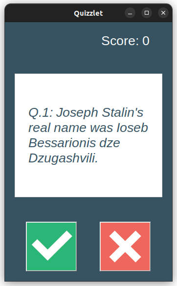
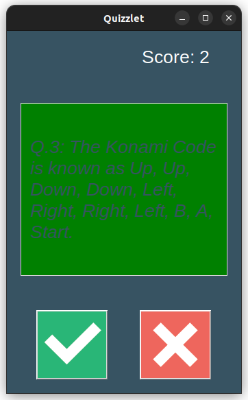
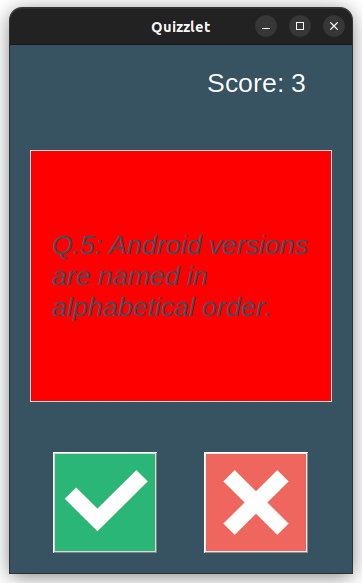
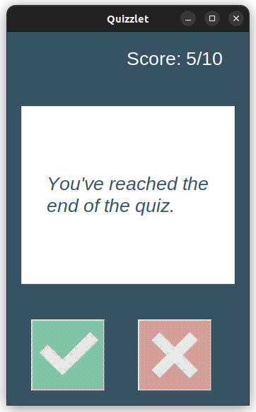

# Quizlet

### [twitter](https://twitter.com/achte_te)

## Description
A GUI based Quiz App that uses Open Trivia Database API.  

## Requirements

[Python](https://www.python.org/)

```sh
$ python3 --version
Python 3.9.12
```

[requests](https://pypi.org/project/requests/)

[tkinter](https://docs.python.org/3/library/tkinter.html)

[html](https://docs.python.org/3/library/html.html)

[Open Trivia Database API](https://opentdb.com/api_config.php)

## Install

```sh
$ git clone git@github.com:achte-2022/Quizlet.git
```

## Run

```sh
$ cd Quizlet
$ python3 main.py
```

## Application Screen

### Starting Screen


### Correct Answer


### Incorrect Answer



### Final Screen

